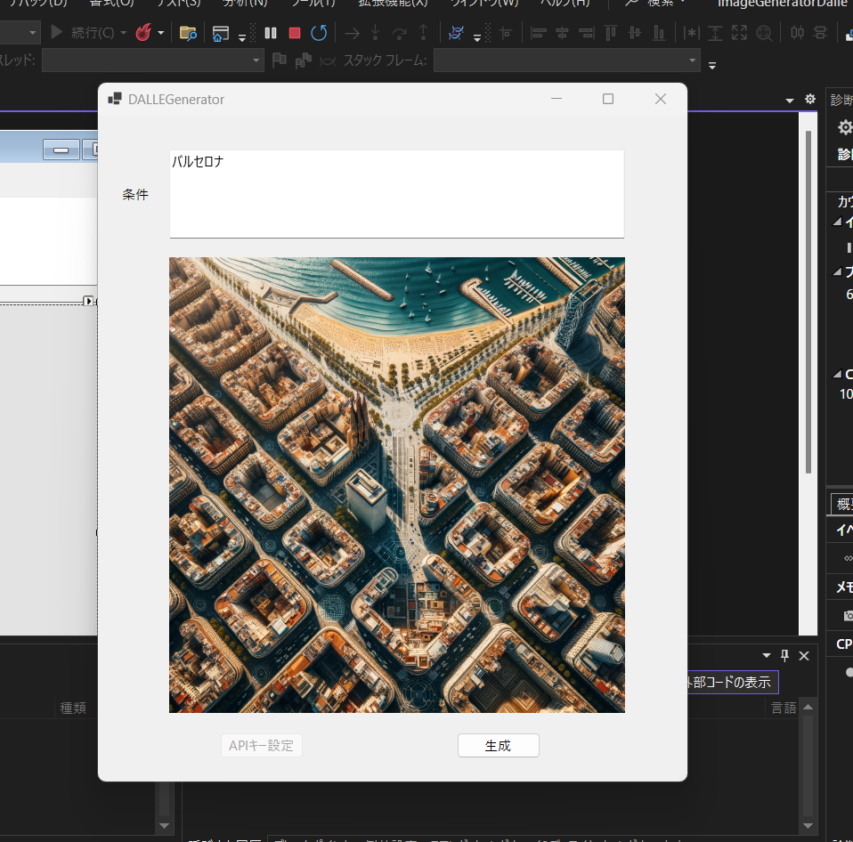

# ImageGeneratorDalle

ImageGeneratorDalleは、テキストプロンプトを元にAIが画像を生成するWinformアプリケーションです。本アプリケーションは、.NET 8上で動作し、OpenAIのDALL-E 3モデルを利用して、指定されたテキストに基づく画像を生成します。

## 機能概要
1. **プロンプト入力**: ユーザーは、画面のプロンプトボックスに画像生成のためのテキストを入力します。
2. **画像生成**: 入力されたテキストプロンプトに基づいて、AI（DALL-E 3）モデルが画像を生成します。

## 使用技術
- **プラットフォーム**: .NET 8
- **AIモデル**: DALL-E 3（OpenAI APIを通じて使用）
- **ライブラリ**: dotnet-OpenAI

## 動作環境
- .NET 8 ランタイムがインストールされたWindows環境

## インストール方法
1. .NET 8 SDKをインストールします: [.NET 8 ダウンロードページ](https://dotnet.microsoft.com/download/dotnet/8.0)
2. このリポジトリをクローン、もしくはダウンロードします。
3. `dotnet run` コマンドを使用してアプリケーションを起動します。

## 使い方
1. アプリケーションを起動します。
2. プロンプトボックスに、生成したい画像の説明を入力します。
3. 「生成」ボタンを押すと、AIが入力されたテキストプロンプトに基づいて画像を生成します。

## 依存ライブラリ
- [dotnet-OpenAI](https://github.com/betalgo/dotnet-openai): .NETでOpenAIのAPIを利用するためのライブラリです。

## ライセンス
このプロジェクトはMITライセンスの下で提供されています。詳細については、[LICENSE](./LICENSE)ファイルを参照してください。

